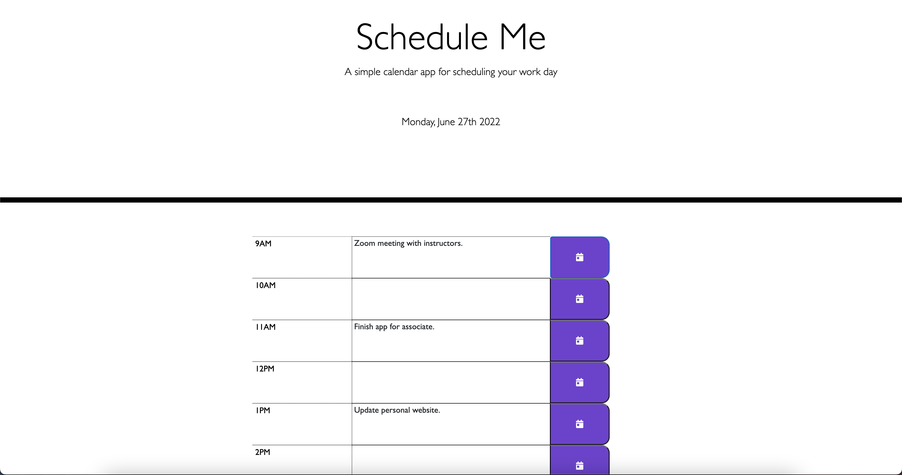

# schedule-me

Schedule Me is a workday scheduler/application that allows the user to plan out their workdays by providing time blocks for each hour in which the user can enter tasks to complete and save them into local storage. This allows the user to continue to access the application with the inputs saved so they can continue to refer to it throughout the day.
When the day is over, the application will reset to reflect a new workday.

USER STORY:
AS AN employee with a busy schedule
I WANT to add important events to a daily planner
SO THAT I can manage my time effectively

ACCEPTANCE CRITERIA:
GIVEN I am using a daily planner to create a schedule
WHEN I open the planner
THEN the current day is displayed at the top of the calendar
WHEN I scroll down
THEN I am presented with time blocks for standard business hours
WHEN I view the time blocks for that day
THEN each time block is color-coded to indicate whether it is in the past, present, or future
WHEN I click into a time block
THEN I can enter an event
WHEN I click the save button for that time block
THEN the text for that event is saved in local storage
WHEN I refresh the page
THEN the saved events persist

My biggest challenge creating this application was understanding how to cleanly generate the dynamic html to create the input boxes.

Github Repo: https://github.com/ArumMelton/schedule-me

Deployed Application: https://arummelton.github.io/schedule-me/

Below is a screenshot of the deployed application being used.

